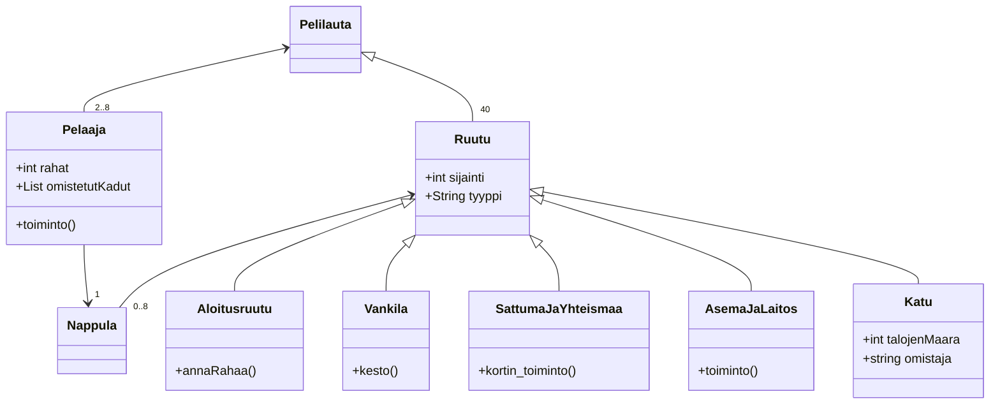

```mermaid
classDiagram
	Pelilauta <|-- "40" Ruutu
	Pelaaja --> "1" Nappula
	Ruutu <-- "0..8" Nappula
	Pelilauta <-- "2..8" Pelaaja
	Ruutu <|-- Aloitusruutu
	Ruutu <|-- Vankila
	Ruutu <|-- SattumaJaYhteismaa
	Ruutu <|-- AsemaJaLaitos
	Ruutu <|-- Katu
	class Ruutu{
		+int sijainti
		+String tyyppi	
	}
	class Aloitusruutu{
		+annaRahaa()
	}
	class Vankila{
		+kesto()
	}
	class SattumaJaYhteismaa{
		+kortin_toiminto()
	}
	class AsemaJaLaitos{
		+toiminto()
	}
	class Katu{
		+int talojenMaara
		+string omistaja	
	}
	class Pelaaja{
		+int rahat
		+List omistetutKadut
		+toiminto()
	}


```
