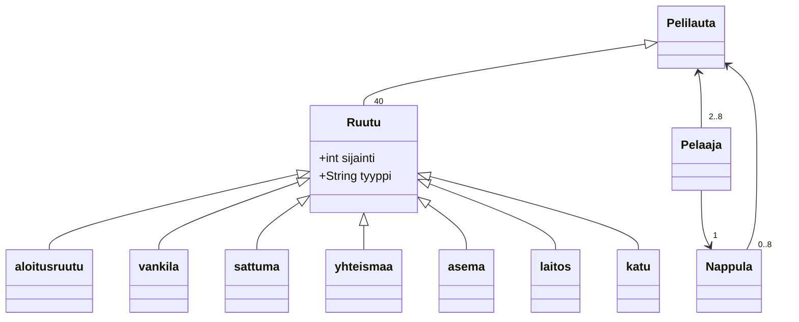

```mermaid
classDiagram
	Pelilauta <|-- "40" Ruutu
	Pelaaja --> "1" Nappula
	Pelilauta <-- "0..8" Nappula
	Pelilauta <-- "2..8" Pelaaja
	Ruutu <|-- aloitusruutu
	Ruutu <|-- vankila
	Ruutu <|-- sattuma
	Ruutu <|-- yhteismaa
	Ruutu <|-- asema
	Ruutu <|-- laitos
	Ruutu <|-- katu
	class Ruutu{
		+int sijainti
		+String tyyppi	
	}
	
	
	


```
