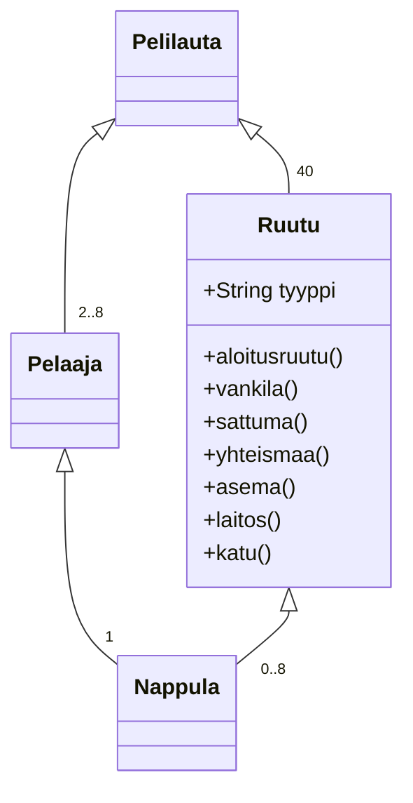

```mermaid
classDiagram
	Pelilauta <|-- "40" Ruutu
	Pelaaja <|-- "1" Nappula
	Ruutu <|-- "0..8" Nappula
	Pelilauta <|-- "2..8" Pelaaja
	class Ruutu{
		+String tyyppi
		+aloitusruutu()
		+vankila()
		+sattuma()
		+yhteismaa()
		+asema()
		+laitos()
		+katu()
	
	}
	


```
