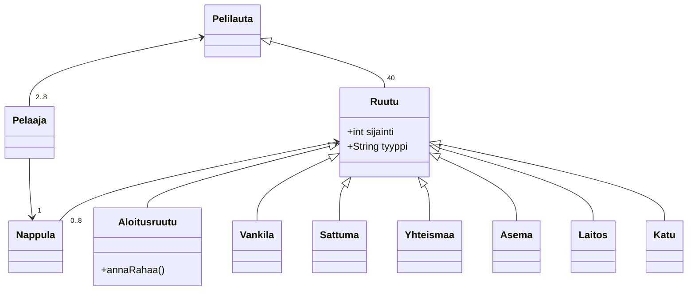

```mermaid
classDiagram
	Pelilauta <|-- "40" Ruutu
	Pelaaja --> "1" Nappula
	Ruutu <-- "0..8" Nappula
	Pelilauta <-- "2..8" Pelaaja
	Ruutu <|-- Aloitusruutu
	Ruutu <|-- Vankila
	Ruutu <|-- Sattuma
	Ruutu <|-- Yhteismaa
	Ruutu <|-- Asema
	Ruutu <|-- Laitos
	Ruutu <|-- Katu
	class Ruutu{
		+int sijainti
		+String tyyppi	
	}
	class Aloitusruutu{
		+annaRahaa()
	}
		
	
	


```
