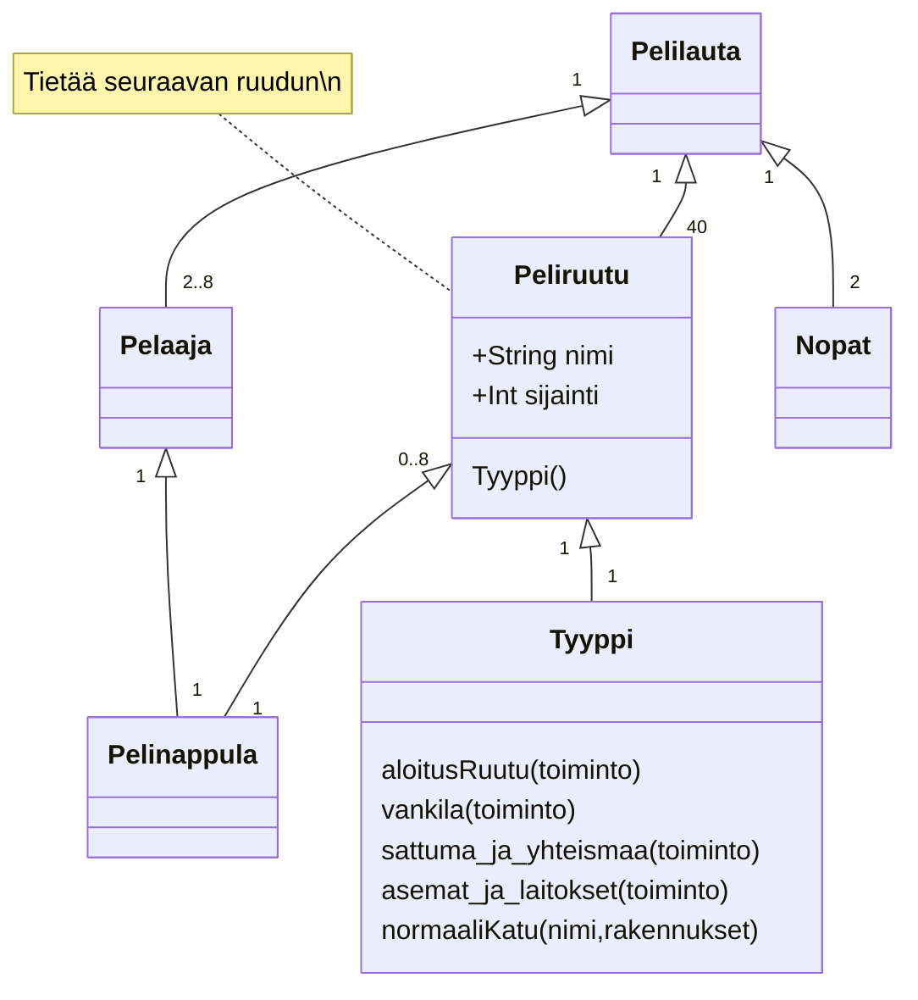

```mermaid
classDiagram
	class Pelilauta
	class Pelaaja
	class Peliruutu
	Peliruutu : +String nimi
	Peliruutu : +Int sijainti
	Peliruutu : Tyyppi()
	class Tyyppi
	Tyyppi : aloitusRuutu(toiminto)
	Tyyppi : vankila(toiminto)
	Tyyppi : sattuma_ja_yhteismaa(toiminto)
	Tyyppi : asemat_ja_laitokset(toiminto)
	Tyyppi : normaaliKatu(nimi,rakennukset)
	note for Peliruutu "Tietää seuraavan ruudun\n"
	class Nopat
	class Pelinappula
Pelilauta "1" <|-- "2..8" Pelaaja
Pelilauta "1" <|-- "40" Peliruutu
Pelilauta "1" <|-- "2" Nopat
Pelaaja "1" <|-- "1" Pelinappula
Peliruutu "0..8" <|-- "1" Pelinappula
Peliruutu "1" <|-- "1" Tyyppi
```
