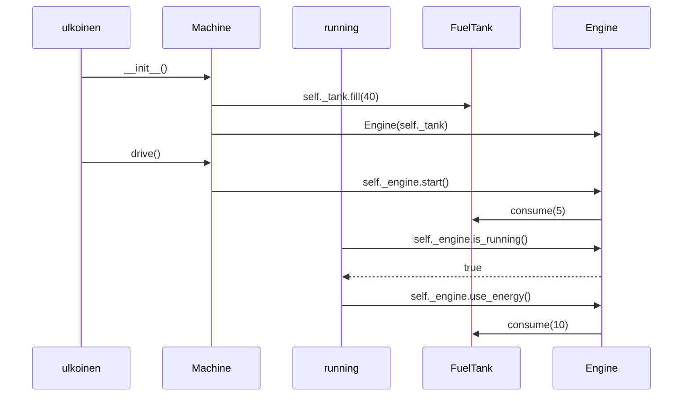

```mermaid
sequenceDiagram
	participant ulkoinen
	participant Machine
	participant running
	participant FuelTank
	participant Engine

	
	ulkoinen ->> Machine: __init__()
	Machine ->> FuelTank: self._tank.fill(40)
	Machine ->> Engine: Engine(self._tank)
	ulkoinen ->> Machine: drive()
	Machine ->> Engine: self._engine.start()
	Engine ->> FuelTank: consume(5)
	running ->> Engine: self._engine.is_running()
	Engine -->> running: true
	running ->> Engine: self._engine.use_energy()
	Engine ->> FuelTank: consume(10)

```
